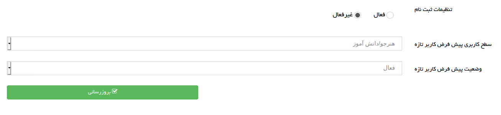

# رویداد
در برنامه رویدادها یا event های بسیاری وجود دارد که لازم است در ازای آن رویداد، عملیاتی انجام شود. درواقع listener یا شنونده هایی برای رویداد تعریف میشود که منتظر هستند تا رویداد آنها را صدا بزند تا عملیات تعریف شده در listener انجام شود. 

بطور مثال افزودن مقاله جدید رویداد است که لازم است بعد از آن رویداد ایمیلی برای اطلاع رسانی ارسال شود، عملیات ارسال ایمیل در listener انجام می‌شود.

**توجه :** هر رویداد میتواند چندین شنونده مجزا داشته باشد.

در فریمورک برای کار با رویداد ها کلاس `packages\base\event` تعریف شده است. 
بهتر است برای یکپارچگی بیشتر کدهای مربوط به رویدادها را در پوشه‌ای به نام events و شنونده‌ها را در پوشه ای به نام listeners ایجاد کنید.

رویدادها و شنونده‌ی مربوط به آن در فایل package.json پوشه اصلی تحت عنوان کلید `events` معرفی می‌شوند.

namespace مربوط به هر event را در کلید `name` و شنونده مربوط به آن در کلید `listener` معرفی میشود.

**نکته :** اگر هر کدام از رویداد یا شنونده، در پکیج اصلی پروژه تعریف شده باشد لازم به نوشتن `packages/packagename` در ابتدای namespace آن نیست.

**نمونه فایل package.json**
```json
{
	"permissions": "*",
	"routing": "routing.json",
	"frontend": ["frontend", "panel", "userpanel"],
	"autoload": {
		"directories": ["controllers", "Models", "listeners", "events"]
	},
	"dependencies": ["userpanel", "sms", "email"],
	"languages": {
		"fa_IR": "langs/fa_IR.json"
	},
    "events": [
        {
            "name":"packages/userpanel/events/search",
            "listener": "listeners/search@find"
        },
        {
            "name":"packages/userpanel/events/search",
            "listener": "listeners/users@list"
        },
        {
            "name":"packages/sms/events/templates",
            "listener": "listeners/sms@templates"
        },
        {
            "name":"packages/email/events/templates",
            "listener": "listeners/email@templates"
        }
    ]
}
```
در مثال فوق برای رویداد packages/userpanel/events/search دو شنونده مجزا listeners/search@find و listeners/users@list تعریف شده است.


## [اجرا رویداد](#run_event)
 برای استفاده از رویداد لازم است ابتدا شئ از کلاس رویداد ایجاد شود و متد `trigger()` روی شئ فراخوانی شود.
متد trigger در کلاس `packages\base\events` تعریف شده است و برای اجرای رویداد فراخونی می‌شود.

اگر در ثبت یک رویداد لازم به استفاده از مقدار متغیری باشید میتوانید آن را در هنگام ایجاد شئ از کلاس رویداد مقداردهی کنید.
بطور مثال اگر در ثبت نام کاربر برای ارسال ایمیل تایید لازم به استفاده از مشخصات کاربر باشید، میتوانید اطلاعات مورد نیاز را هنگام ایجاد شئ کلاس event در شئ کلاس مقدار دهی کنید.

**نمونه فایل کنترلر**
```php
<?php
namespace packages\packagename\controllers;
use packages\packagename\events\Email;
use packages\packagename\User;
use packages\base\{View, Http, Controller};
use themes\themename\views;

class Users extends Controller {

    public function insert() {
        $view = View::byName(views\users\Insert::class);
        $this->response->setView($view);
        
        if(Http::is_post()) {
            $rules = array(
                'name' => array(
                    'type' => 'string',
                ),
                'lastname' => array(
                    'type' => 'string',
                    'optional' => true,
                ),
                'email' => array(
                    'type' => 'email',
                )
            );
            $inputs = $this->checkInputs($rules);
            $user = new User($inputs);
            $user->save();

            $emailEvent = new Email($user);
            $emailEvent->trigger();
        }

        return $this->response;
    }
}
```
در مثال فوق کاربر ثبت شده به شئ رویداد Email داده میشود.
 __برای اطلاعات بیشتر در رابطه با کار با پایگاه داده به صفحه [ارتباط شئ گرا پایگاه داده](dbObject.md) مراجعه کنید.__


## [ایجاد کلاس رویداد](#create_event)
بهتر است کلاس هایی که برای رویدادها تعریف میشود در پوشه events ایجاد شوند. 

باید کلاس رویداد از کلاس `packages\base\event` ارث بری کند.

**مثال** 
```php
<?php
namespace packages\packagename\events;

use packages\base\Event;
use packages\packagename\User;

class Email extends Event {
	private $user;
	public function __construct(User $user) {
		$this->user = $user;
    }
    
    public function getName(): string {
        return $this->user->name.' '.$this->user->lastname ;
    }

    public function getEmail(): string {
        return $this->user->email;
    }
}
```

## [ایجاد کلاس شنونده](#create_listener)
بهتر است کلاس هایی که برای شنونده ها ایجاد میشود در پوشه‌ای مجزا به نام listeners ایجاد شوند.

هنگام معرفی رویداد‌‌ها در فایل package.json برای شنونده‌‌ها متد مشخص شده است. ورودی این متد شئ از کلاس رویداد است که از طریق آن میتوان به متغیرها و متدهای کلاس دسترسی داشت.

**مثال**
```php
/**
 * نمونه فایل package.json
 * 
 * [
 *  {
 *      "name":"packages\packagename\events\Email",
 *      "listener": "listeners/Email@templates"
 *  }
 * ]
 **/
<?php
namespace packages\packagename\listeners;
use packages\packagename\events\Email as EmailEvant;

class Email {
    public $userEmail;
    public $name;
    const $SENDER = "email@example.com";

	public function templates(EmailEvant $event){
        $this->name = $event->getName();
        $this->userEmail = $event->getEmail();
        $this->sendEmail();
    }
    
    private function sendEmail() {
        $subject = "register successfully";
        $body = $this->name. " Your registration completed successfully";

        mail($this->userEmail, $subject, $body, self::SENDER);
    }
}
```


در ادامه مثالی کامل از رویدادها و کاربرد آن در قالب میزنیم.

میخواهیم در برنامه تنظیماتی برای ثبت کاربر ایجاد کنیم. این تنظیمات زمان ثبت کاربر جدید به عنوان مقدار پیشفرض مشخصات کاربر در نظر گرفته میشوند.

**فایل package.json**
```json
{
	"permissions": "*",
	"routing": "routing.json",
	"frontend":"frontend",
	"autoload": {
		"directories": ["controllers", "events", "listeners", "models"]
	},
	"dependencies": ["base"],
	"languages":{
		"fa_IR": "langs/fa_IR.json",
		"en_US": "langs/en_US.json"
	},
	"events": [
		{
			"name":"events/Settings",
			"listener": "listeners/Settings@init"
		}
	]
}
```

**فایل کنترلر**
```php
<?php
namespace packages\packagename\controllers;
use packages\packagename\events\Settings as SettingsEvent;
use packages\base\{View, Http, Controller};
use themes\themename\views;

class Settings extends Controller {

    public function view() {
        $view = View::byName(views\Settings::class);
        $this->response->setView($view);
        
        $event = new SettingsEvent();
		$event->trigger();
		if (!$event->get()) {
			throw new NotFound();
		}
		$view->setSettings($event->get());

        return $this->response;
    }
}
```
در کنترلر زمانی که متد view فراخوانی شود، رویداد SettingsEvent اجرا میشود. 
بعد از اجرا رویداد متد get که در کلاس رویداد تعریف شده است فراخوانی می‌شود و تنظیمات از طریق متد setSettings به view منتقل می‌شود.

**کلاس رویداد**
```php
<?php
namespace packages\packagename\events;
use packages\packagename\events\settings\Setting;
use packages\base\event;

class Settings extends event {
    private $settings = [];
    
	public function addSetting(Setting $setting) {
		$this->settings[$setting->getName()] = $setting;
	}
    
    public function get(){
		return $this->settings;
	}
}
```
در این رویداد دو متد تعریف شده. متد addSetting برای اضافه کردن تنظیم ایجاد شده است که از متدهای کلاس Setting نیز استفاده میکنم. کلاس Setting به عنوان کلاس کمکی تعریف شده است.

متد get تنظیمات ایجاد شده را برمیگرداند. 

**کلاس کمکی Setting**
```php
<?php
namespace packages\packagename\events\settings;
use packages\base\event;

class Setting {
	private $name;
	private $package;
	private $inputs = [];
	private $fields = [];
	private $controller;
	private $data = [];
    
    function __construct($name) {
		$this->setName($name);
	}
    
    public function setName(string $name) {
		$this->name = $name;
	}
	public function getName():string {
		return $this->name;
	}
    
    public function addField(array $field) {
		$this->fields[] = $field;
	}
	public function getFields():array {
		return $this->fields;
	}
	
	public function setDataForm(string $name, $value) {
		$this->data[$name] = $value;
	}
	public function getDataForm(string $name = '') {
		if ($name) {
			return $this->data[$name] ?? null;
		}
		return $this->data;
	}
}
```
این کلاس به عنوان کلاس کمکی برای رویداد Settings ایجاد شده است. در این کلاس مشخصات  input هایی که برای تنظیمات لازم داریم مقداردهی میشود. همچنین میتوانیم داده پیشفرض برای فیلدها مشخص کنیم.


**کلاس listener**
```php
<?php
namespace packages\packagename\listeners;

use ackages\packagename\Usertype;
use packages\packagename\events\Settings as SettingsEvent;

class Settings {
	
	public function init(SettingsEvent $settings){
		
		$setting = new SettingsEvent\Setting('userpanel');
		$this->addRegisterItems($setting);
		$settings->addSetting($setting);
	}

	private function addRegisterItems(SettingsEvent\Setting $setting) {
		$setting->addField(array(
			'name' => 'userpanel_register_enabled',
			'type' => 'radio',
			'label' => t('settings.userpanel.register'),
			'inline' => true,
			'options' => array(
				array(
					'label' => t('active'),
					'value' => 1,
				),
				array(
					'label' => t('deactive'),
					'value' => 0,
				),
			),
		));
		$setting->addField(array(
			'name' => 'userpanel_register_type',
			'type' => 'select',
			'label' => t('settings.userpanel.register.usertype'),
			'options' => $this->getUserTypesForSelect(),
		));
		$setting->addField(array(
			'name' => 'userpanel_register_status',
			'type' => 'select',
			'label' => t('settings.userpanel.register.status'),
			'options' => $this->getUserStatusForSelect(),
        ));
        
		$setting->setDataForm('userpanel_register_enabled', false);
		$setting->setDataForm('userpanel_register_type', 1);
		$setting->setDataForm('userpanel_register_status', 1);
    }
    
	private function getUserTypesForSelect(): array {
		$options = array();
		foreach (Usertype::get() as $type) {
			$options[] = array(
				"title" => $type->title,
				"value" => $type->id,
			);
		}
		return $options;
    }
    
	private function getUserStatusForSelect(): array {
		return array(
			array(
				"title" => t("active"),
				"value" => 1,
			),
			array(
				"title" => t("deactive"),
				"value" => 2,
			),
			array(
				"title" => t("suspend"),
				"value" => 3,
			),
		);
	}

}
```
طبق تنظیماتی که در فایل package.json انجام شده در ابتدا متد init کلاس listener فراخوانی میشود. ورودی متد init شئ از کلاس رویداد فراخوان میباشد. 
برای مقداردهی مشخصات فیلدها شئ از کلاس کمکی Setting ایجاد میکنیم.

در متد addRegisterItems مشخصات فیلدها با فراخوانی متد addField کلاس Setting مقداردهی میشود. 

با فراخوانی متد setDataForm برای فیلدها مقدار پیشفرض تعیین میکنیم.


**فایل view**
```php
<?php
namespace themes\packagename\views;
use packages\base\views\Form;
use themes\clipone\{ViewTrait, views\FormTrait};

class Settings extends Form {
	use ViewTrait, FormTrait;
    
    private $settings = array();
    
    public function __beforeLoad(){
		$this->setTitle(t('userpanel.general-settings'));
		$this->addBodyClass('userpanel-settings');
		$this->addBodyClass('userpanel-general-settings');
		$this->initFormData();
	}
	public function setSettings(array $settings) {
		$this->settings = $settings;
	}
	protected function getSettings(): array {
		return $this->settings;
    }
    
	private function initFormData() {
		foreach ($this->getSettings() as $setting) {
			foreach ($setting->getFields() as $input) {
				$value = $setting->getDataForm($input['name']);
				if ($value !== null) {
					$this->setDataForm($value, $input['name']);
				}
			}
		}
	}
}
```
در کنترلر بعد از اجرای رویداد با فراخوانی متد setSettings تنظیمات به قالب منتقل می‌شود. 

در متد initFormData تنظیمات را با متد getSettings گرفته و با فراخوانی متد getDataForm به مقدار پیشفرض تعیین شده دسترسی خواهیم داشت و با فراخوانی متد setDataForm مقادیر پیشفرض تعیین شده را برای فیلدها تنظیم میکنیم. 

**فایل html**
```html
<?php
use packages\base;
?>

<form id="general-settings-form" class="form-horizontal" action="<?php echo base\url('userpanel/settings'); ?>" method="POST">
<?php
$this->setHorizontalForm("md-4 sm-5", "md-8 sm-7");
foreach ($this->getSettings() as $tuning) {
	echo '<div class="settings-row">';
	foreach ($tuning->getFields() as $field) {
		echo '<div class="settings-row-item">';
		$this->createField($field);
		echo "</div>";
	}
	echo "</div>";
}
?>
	<div class="row">
		<div class="col-sm-4 col-sm-offset-8">
			<button class="btn btn-success btn-block" type="submit">
				<i class="fa fa-check-square-o"></i>
			<?php echo t("user.profile.save"); ?>
			</button>
		</div>
	</div>
</form>
```
در فایل html با فراخوانی متد getFields به مشخصات هر فیلد دسترسی داریم و با فراخوانی متد createField فیلدها را ایجاد میکنیم. 

__برای اطلاعات بیشتر از نحوه ایجاد فرم‌ها به صفحه [فرم‌‌ها](form.md) مراجعه کنید.__

نتیجه‌ی مثال فوق فرم زیر میباشد. 
