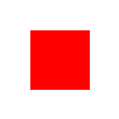
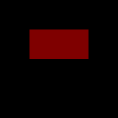

# تصاویر

جالنو کلاس `packages\base\Image` را برای مدیریت تصاویر در اختیار توسعه دهندگان قرار داده است. برخی از متدهای این کلاس بصورت abstract یا مجرد ایجاد شده‌اند و بنابراین برنامه نویس قادر به فراخوانی آن‌ها بصورت مستقیم از این کلاس نمی‌باشد. در حال حاضر کلاس `packages\base\Image\GD` از کلاس Image مشتق شده است.

در فرمورک برای فرمت‌های تصویر JPEG، GIF، PNG، WEBP بصورت مجزا کلاس ایجاد شده است و تمامی کلاس ها که در ادامه بیان می‌شود از کلاس GD ارث بری میکنند. 

|  کلاس |               فرمت تصویر  |
|---------------------------|------|
| <div class="display-block ltr">packages\base\Image\GIF</span>   | <div class="display-block text-center">GIF</span>  |
| <div class="display-block ltr">packages\base\Image\JPEG</span>  | <div class="display-block text-center">JPEG</span> |
| <div class="display-block ltr">packages\base\Image\PNG</span>   | <div class="display-block text-center">PNG</span>  |
| <div class="display-block ltr">packages\base\Image\WEBP</span>  | <div class="display-block text-center">WEBP</span> |


## [ایجاد شئ](#object)
یک شئ‌ از کلاس Image میتواند برای ایجاد تصویر جدید و یا تغییرات تصویر موجود مورد استفاده قرار گیرد که برای هر یک از موارد مقدار دهی آرگومان های متد سازنده متفاوت میباشد. 

### ایجاد تصویر جدید
زمانی که قصد ایجاد تصویر جدید را دارید، شئ از کلاس فرمتی که برای تصویر در نظر دارید ایجاد میکنید. 
متد سازنده سه آرگومان ورودی میگیرد. 
آرگومان اول عرض تصویر،‌آرگومان دوم ارتفاع و آگومان سوم رنگ زمینه تصویر میباشد
که آرگومان سوم باید از جنس کلاس [Color](#color) باشد.

**توجه :** ابعاد تصویر برحسب px میباشند.

در مثال های زیر تصویری با عرض 200px و ارتفاع 150px و رنگ زمینه مشکی در فرمت مشخص شده ایجاد می‌شود.


```php
use packages\base\Image;

// ایجاد تصویر با فرمت JPEG
$image = new Image\JPEG(200, 150, Image\Color::fromRGB(0, 0, 0));

// ایجاد تصویر با فرمت PNG
$image = new Image\PNG(200, 150, Image\Color::fromRGB(0, 0, 0));

// ایجاد تصویر با فرمت GIF
$image = new Image\GIF(200, 150, Image\Color::fromRGB(0, 0, 0));

// ایجاد تصویر با فرمت WEBP
$image = new Image\WEBP(200, 150, Image\Color::fromRGB(0, 0, 0));
```

### فایل یا تصویر موجود
زمانی که قصد کار روی تصویر موجودی را دارید، شئ از کلاس فرمت تصویر ایجاد میکنید. متد سازنده یک آرگومان ورودی میگیرد که شئ از کلاس [file](file.md) و یا کلاس Image میباشد.

**توجه :** فایل معرفی شده حتما باید وجود داشته باشد درصورتی که فایل موجود نباشد استثنا از جنس NotFoundException پرتاب می‌شود.

**توجه :** اگر شئ ایجاد شده از کلاس فایل، مربوط به تصویری با فرمت jpeg باشد اما شئ‌ از کلاس Image\PNG ایجاد شود warning دریافت میکنید.

مثال از کد **خطا**
```php
use packages\base\Image;


$file = new File\Local("packages/my_package/storage/images/image.jpg");
$image = new Image\PNG($file);
```

**خروجی**
````
Warning: imagecreatefrompng(): 'packages/my_package/storage/images/image.jpg' is not a valid PNG file 
````

مثال از کد **صحیح**
```php
use packages\base\Image;


$image = new Image\JPEG(new File\Local("packages/my_package/storage/images/image.jpeg"));


$image = new Image\PNG(new File\Local("packages/my_package/storage/images/image.png"));


$image = new Image\GIF(new File\Local("packages/my_package/storage/images/image.gif"));


$image = new Image\WEBP(new File\Local("packages/my_package/storage/images/image.webp"));
```


## [متدها](#methods)
برای کار با تصاویر متدهای زیر ایجاد شده است که در تمامی کلاس های فوق  میتوانید آن‌ها را فراخوانی کنید.


|  متد |                کاربرد  |
|---------------------------|------|
| <div class="display-block ltr">saveToFile(File $file, int $quality)</span>  | ذخیره تصویر در مکان مشخص |
| <div class="display-block ltr">save(int $quality)</span>  | ذخیره تصویر |
| <div class="display-block ltr">getFile()</span>   | شئ از کلاس File برمیگرداند  |
| <div class="display-block ltr">getWidth()</span>  |   خواندن عرض تصویر|
| <div class="display-block ltr">getHeight()</span>  |  خواندن ارتفاع تصویر|
| <div class="display-block ltr">getExtension</span>  |  خواندن فرمت تصویر|
| <div class="display-block ltr">resize(int $width, int $height)</span>  |  تغییر ابعاد تصویر|
| <div class="display-block ltr">resizeToHeight(int $height)</span>  | تغییر ارتفاع تصویر |
| <div class="display-block ltr">resizeToWidth(int $width)</span>  | تغییر عرض تصویر |
| <div class="display-block ltr">scale(int $scale)</span>  | زوم تصویر |
| <div class="display-block ltr">colorAt(int $x, int $y)</span>  | خواندن رنگ پیکسل مشخصی از تصویر |
| <div class="display-block ltr">setColorAt</span>  | رنگ کردن پیکسل مشخص  |
| <div class="display-block ltr">paste(Image $image, int $x, int $y)</span>  | جایگذاری در بخشی از تصویر |
| <div class="display-block ltr">copy(int $x, int $y, int $width, $height)</span>  | کپی کردن قسمتی از تصویر |
| <div class="display-block ltr">rotate(float $angle, Image\Color $bg)</span>  | چرخش تصویر |
| <div class="display-block ltr">fromFormat(File $file)</span>   |  تبدیل شئ فایل به شئ کلاس تصویر طبق فرمت |
| <div class="display-block ltr">fromContent(File $file)</span>  | تبدیل شئ فایل به شئ کلاس تصویر طبق محتوا |


## [ذخیره تصویر](#save_image)
اطلاعاتی که از سمت کاربر ارسال می‌شود میتواند تصویر باشد برای ذخیره تصویر دریافتی نیز باید از متدهای کلاس image استفاده کنید. 

متدهای `saveToFile` و `save` برای ذخیره تصاویر استفاده میشود. 

متد `save` برای ذخیره تصویری که وجود دارد استفاده می‌شود و تغییرات را در همان تصویر قبلی ذخیره میکند. متد save آرگومان ورودی ندارد.

متد `saveToFile` تصویر را در مکان جدیدی ذخیره میکند. آرگومان ورودی شئ از کلاس [File](file.md) میباشد.

**توجه** اگر شئ فایل، آدرس فایلی باشد که موجود است فایل جدید **جایگزین** فایل قبلی میشود.

**مثال**
```php
<?php
namespace packages\my_package\controllers;

use theme\theme_name\views;
use packages\my_package\User;
use packages\base\{Image, IO\File, Packages, View, Http};

class profile extends controller{

    public function update($data) {
        $user = User::byId($data['id']);
        if (!$user) {
            throw new NotFound;
        } 
        $view = View::byName(views\profile\Update::class);
        $this->response->setView($view);
        
        if (Http::is_post()) {
            $inputs = array(
                'name' => array(
                    'type' => 'string'
                ),
                'lastname' => array(
                    'type' => 'string'
                ),
                'avatar' => array(
                    'optional' => true,
                    'empty' => true,
                    'type' => 'image'
                )
            );

            $formdata = $this->checkinputs($inputs);
            
            if (isset($formdata['avatar'])) {

                $formdata['avatar']->resize(200, 200)->save();    
                
                $path = 'storage/public_avatar/' . $formdata['avatar']->getFile()->md5() . '.' . $formdata['avatar']->getExtension();
                
                $avatar = Packages::package('my_package')->getFile($path);
                $directory = $avatar->getDirectory();
                if (!$directory->exists()) {
                    $directory->make(true);
                }
				$formdata['avatar']->saveToFile($avatar);
				
				$formdata['avatar'] = $path;
            }

            $user->avatar = $formdata['avatar'];
            $user->name = $formdata['name'];
            $user->lastname = $formdata['lastname'];
            $user->save();
        }
        
        return $this->response;
    }
}
```

## [ترسیم تصویر](#set_color_at) 
با استفاده از متد `setColorAt` میتوانید تصویری را ترسیم کنید. 
نحوه ی کار متد به اینصورت است که مختصات پیکسل را گرفته و مصابق رنگ تعیین شده آن پیکسل را رنگ میکند. در واقع برای ترسیم تصویر لازم است پیکسل به پیکسل پیش برویم. 

متد setColorAt سه آرگومان ورودی میگیرد، آرگومان اول موقعیت پیکسل در محور x و آرگومان دوم موقعیت پیکسل در محور y میباشد; در آرگومان سوم رنگ مورد نظر را از جنس کلاس [Color](#color) دریافت میکند.

در مثال زیر قصد ترسیم یک ضربدر در تصویر داریم.

**1 مثال**
```php
<?php
namespace packages\my_package\controllers;

use packages\base\{Image, IO\File, Packages};

class Drawing extends controller{

    public function closeSign() {
        
        $image = new Image\PNG(100, 100 , Image\Color::fromRGB(255, 255, 255));

        $yellow = Image\Color::fromRGB(248, 195, 13);

        for ($i = 1; $i < 100; $i++) {
            $image->setColorAt( $i, $i, $yellow);
            $image->setColorAt( $i, 100-$i, $yellow);
		}
		
		$file = Packages::package("my_package")->getFile("images/closeSign.png");

		$image->saveToFile($file);
		
		$this->response->setStatus(true);
		return $this->response;
    }
}
```
در مثال فوق ابتدا یک تصویر با فرمت png و ابعاد 100px * 100px ایجاد میکنیم. 
سپس در حلقه  for مختصات پیکسل ها را مشخص میکنیم. 
بطور مثال زمانی که $i = 4 است.

<span class="d-inline ltr">$image->setColorAt( 4, 96, $yellow)</span> : پیکسلی که x آن برابر 4 و y آن برابر 96 باشد، رنگ آن زرد می‌شود. 

تصویر ایجاد شده در کد فوق بصورت زیر می‌باشد.


### خواندن رنگ پیکسل 
همچنین متد `colorAt` رنگ پیکسل مشخص شده را برمیگرداند. 
خروجی این متد از جنس کلاس [Color](#color) می‌باشد.

متد colorAt دو آرگومان ورودی میگیرد که آرگومان اول موقعیت پیکسل روی محور x و آرگومان دوم موقعیت پیکسل روی محور y میباشد.


**مثال 2**
```php
$image = new Image\PNG(new File\Local("packages/my_package/images/closeSign.png");

$color = $image->colorAt(4, 96);
/**
 * $color :
 * packages\base\Image\Color Object
 *  (
 *      [r:packages\base\Image\Color:private] => 248
 *      [g:packages\base\Image\Color:private] => 195
 *      [b:packages\base\Image\Color:private] => 13
 *      [a:packages\base\Image\Color:private] => 1
 *  )
 */
```
اگر تصویر <span class="d-inline ltr">$image</span> را تصویر ایجاد شده در مثال 1 در نظر بگیریم در متغیر <span class="d-inline ltr">$color</span> شئ از کلاس Color که بیانگر کد رنگ زرد است ذخیره می‌شود.


## [کپی کردن قسمتی از یک تصویر](#copy)
با استفاده از متد `copy` میتوانید قسمتی از یک تصویر را کپی کنید.
برای مشخص کردن قسمتی که قصد کپی کردن آن را دارید، باید مختصات یک پیکسل و عرض و ارتفاع آن قسمت را مشخص کنید.
متد copy چهار آرگومان ورودی میگیرد. آرگومان اول موقعیت پیکسل روی محور x ، آرگومان دوم موقعیت پیکسل روی محور y ، در آرگومان سوم عرض و آرگومان چهارم ارتفاع آن قسمت می‌باشد.

قسمت مشخص شده در واقع از پیکسلی که مختصات آن مشخص شده است به تعداد پیکسل عرض به سمت راست و به تعداد پیکسل ارتفاع به سمت پایین را شامل می‌شود.

با فراخوانی متد`paste` میتوانید تصویری را در تصویرتان جایگذاری کنید. 
متد paste چهار آرگومان ورودی میگیرد. آرگومان اول تصویری که قصد دارید آن را جایگذاری کنید، آرگومان دوم موقعیت پیکسل روی محور x و آرگومان سوم موقعیت پیکسل روی محور y میباشد. آرگومان چهارم درصد شفافیت تصویر را مشخص میکند که عددی بین 0 و 1 میباشد.

موقعیت تصویر جایگذاری شده، از پیکسلی که مشخص شده است، به اندازه عرض آن به سمت راست و اندازه ارتفاع آن به سمت پایین، در تصویر قرار میگیرد.

**توجه :** درصد شفافیت تصویر تنها برای تصاویر با فرمت png در نظر گرفته میشود برای سایر فرمت ها همواره 1 در نظر گرفته میشود.

**مثال**
```php
<?php
namespace packages\my_package\controllers;

use packages\base\{Image, IO\File, Packages};

class Drawing extends controller{

    public function square() {
        
        $image = new Image\JPEG(200, 200 , Image\Color::fromRGB(255, 255, 255));

        $red = Image\Color::fromRGB(255, 0, 0);

        for ($i = 51; $i < 151; $i++) {
            for ($j=51; $j < 151; $j++) { 
                $image->setColorAt( $i, $j, $red);
            }
        }

        $image->saveToFile(new File\Local("packages/my_package/images/square.png"));

        $partOfImage = $image->copy(51, 51, 100, 50);
        
        $new = new Image\PNG(200, 200 , Image\Color::fromRGB(0, 0, 0));
        $new->paste($partOfImage, 50, 50, 0.5);
        $new->saveToFile(new File\Local("packages/my_package/images/new_square.png"));
    }
}
```
در مثال فوق یک مربع به رنگ قرمز با ابعاد 100px * 100px در وسط تصویر ایجاد می‌شود.

سپس با فراخوانی متد copy قسمت بالایی مربع به شکل مستطیلی با ابعاد 100px * 50px کپی شده.
تصویر جدیدی با رنگ زمینه مشکی ایجاد شده و مستطیل کپی شده، از پیکسل با مختصات (50,50) و با درصد شفافیت 0.5 جایگذاری میشود.

تصاویر ایجاد شده بصورت زیر میباشند.




## [تغییر اندازه](#resize)
برای تغییر اندازه تصویر متد `resize` ایجاد شده است. دو آرگومان ورودی میگیرد که آرگومان اول اندازه عرض و آرگومان دوم ارتفاع میباشد. 

همچنین متدهای `resizeToHeight` و `resizeToWidth` برای تغییر اندازه مجزا ابعاد ایجاد شده است.

**توجه :** برای ذخیره تصاویری که متد resize و resizeToHeight و resizeToWidth روی آن فراخوانی شده است باید از متد `saveToFile` استفاده شود. نمیتوانید متد `save` را برای آن فراخوانی کنید.

**مثال**
```php
<?php
namespace packages\my_package\controllers;

use packages\base\{Image, IO\File, Packages};

class Picture extends controller {

    public function resizePic() {
        $image = new Image\JPEG(new File\Local("packages/my_package/img.jpeg"));
		$image->resize(150, 150)->saveToFile(new File\Local("packages/my_package/newImg.jpeg"));

		$this->response->setStatus(true);
		return $this->response;
    }

    public function resizeHeight () {
        $image = new Image\JPEG(new File\Local("packages/my_package/img.jpeg"));
		$image->resizeToHeight(200)->saveToFile(new File\Local("packages/my_package/newImg.jpeg"));

		$this->response->setStatus(true);
		return $this->response;
    }

    public function resizeWidth () {
        $image = new Image\JPEG(new File\Local("packages/my_package/img.jpeg"));
		$image->resizeToWidth(250)->saveToFile(new File\Local("packages/my_package/newImg.jpeg"));

		$this->response->setStatus(true);
		return $this->response;
    }
}
```

## [زوم کردن تصویر](#scale)
گاها لازم است تصویر زوم شده و ذخیره شود برای این منظور متد `scale` ایجاد شده است. 
ورودی متد scale عدد صحیح از درصد زوم شدن عکس میباشد. 

**توجه :** برای ذخیره تصاویری که متد scale روی آن فراخوانی شده است باید از متد `saveToFile` استفاده شود. نمیتوانید متد `save` را برای آن فراخوانی کنید.

**مثال**
```php
<?php
namespace packages\my_package\controllers;
use packages\base\{Image, IO\File, Packages};

class Picture extends controller{

    function scale() {
        $image = new Image\JPEG(new File\Local("packages/my_package/images/image.jpeg"));

        $image->scale(5)->saveToFile(new File\Local("packages/my_package/images/newImage.jpeg"));
        
    }
}
```
در مثال فوق تصویر به اندازه 5٪ اندازه اولیه تغییر پیدا میکند. 

**توجه :** اگر بخواهید اندازه تصویر دوبرابر شود باید به متد scale عدد 200 داده شود.


## [چرخش تصویر](#rotate)
در کلاس  Image برای چرخش تصویر متد `rotate` ایجاد شده است. 
این متد دو آرگومان ورودی میگیرد که در آرگومان اول زاویه چرخش و در آرگومان دوم رنگ زمینه برای تصویر جدید می‌باشد.

**توجه :** برای ذخیره تصاویری که متد rotate روی آن فراخوانی شده است باید از متد `saveToFile` استفاده شود. نمیتوانید متد `save` را برای آن فراخوانی کنید.

**مثال**
```php
<?php
namespace packages\my_package\controllers;
use packages\base\{Image, IO\File, Packages};

class Picture extends controller{

    public function rotate() {
        $image = new Image\PNG(new File\Local("packages/my_package/images/phpLogo.png"));
        $image->rotate(180, Image\Color::fromRGB(0,0,0,))->saveToFile(new File\Local("packages/my_package/images/newPhpLogo.png"));
        
        $this->response->setStatus(true);
        return $this->response;
    }
}
```

تصویر ایجاد شده در کد فوق بصورت زیر می‌باشد.


## [تبدیل شئ فایل به شئ کلاس تصویر](#convert_file_to_image)
گاها لازم است تصویری که شئ از جنس کلاس [File](file.md) است به شئ از کلاس Image تبدیل شود; برای این منظور دو متد `fromFormat` و `fromContent` ایجاد شده است. 

آرگومان ورودی هر دو متد شئ از کلاس File میباشد. تفاوت متدها در نوع شناسایی فرمت تصویر میباشد. 

متد `fromFormat` فرمت تصویر را با توجه به فرمت فایل معرفی شده شناسایی میکند. 

متد `fromContent` فرمت تصویر را با توجه به محتوای فایل معرفی شده شناسایی میکند. 

**مثال**
```php
use packages\base\Image;

$image = Image::fromContent(new File\Local("packages/my_package/images/img.png"));

// or 

$image = Image::fromFormat(new File\Local("packages/my_package/images/img.png"));

/**
 * packages\base\Image\PNG Object
 *  (
 *      [image:protected] => Resource id #1180
 *      [file:protected] => packages\base\IO\file\local Object
 *          (
 *              [directory] => packages/my_package/images
 *              [basename] => img.png
 *          )
 *
 *  )
 */
```

## [رنگ‌ ها](#color)
هنگام استفاده از متدهای کلاس Image برای ایجاد تصویر جدید،‌ ترسیم تصویر و ... لازم است رنگ مورد نظر را به متد معرفی کنید که ورودی متدها شئ از کلاس `packages\base\Image\Color` می‌باشد. 

## [معرفی رنگ](#create_color) 
از متدهای `fromRGB` و `fromRGBA` برای معرفی رنگ استفاده می‌شود. 
رنگ ها طبق فرمت R G B معرفی میشوند. متدها برای سهولت فراخوانی بصورت `static` تعریف شده‌اند.

در هر دو متد `fromRGB` و `fromRGBA` آرگومان اول کد رنگ `قرمز` , آرگومان دوم کد رنگ `سبز` و آرگومان سوم کد رنگ `آبی` میباشد. 

برای متد `fromRGBA` آرگومان چهارم تعریف شده که برای مشخص کردن وضوح رنگ بکار میرود که عددی بین `صفر` و `یک` مبیاشد. 

**نکته :** هر یک از کد رنگ های RGB عددی بین `0` تا `255` هستند.


```php
use packages\base\Image\Color;

$rgb = Color::fromRGB(17,160,234); // red:17 green:160 blue: 234 => معرف رنگ آبی

$rgba = Color::fromRGBA(235,185,18, 0.2); // red:235 green:185 blue: 18 alpha: 0.2 => معرف رنگ نارنجی
```

## [خواندن رنگ](#get_color)
میتوانید با فراخوانی متدهای `toRGB` و `toRGBA` کد رنگ های معرفی شده را بصورت آرایه دریافت کنید. 
خانه های آرایه به ترتیب معرف کد رنگ های قرمز ، سبز و آبی هستند. 

متد `toRGBA` آرایه‌ای با چهار عنصر بر میگرداند که عنصر چهارم وضوح رنگ را مشخص میکند. 

**توجه :** وضوح رنگ فقط برای تصاویر با فرمت `PNG` کاربرد دارد.

**توجه :** متدهای `toRGB` و `toRGBA` static تعریف `نشده‌اند` و باید آن‌ها روی شئ کلاس Color صدا زده شوند.


```php
use packages\base\Image\Color;


$rgb = Color::fromRGB(17,160,234)
$rgb->toRGB();
/**
 * Array
 *  (
 *      [0] => 17
 *      [1] => 160
 *      [2] => 234
 *  )
 */

$rgba = Color::fromRGBA(235,185,18, 0.2);
$rgba->toRGBA();
/**
 * Array
 *  (
 *      [0] => 235
 *      [1] => 185
 *      [2] => 18
 *      [3] => 0.2
 *  )
 */
```