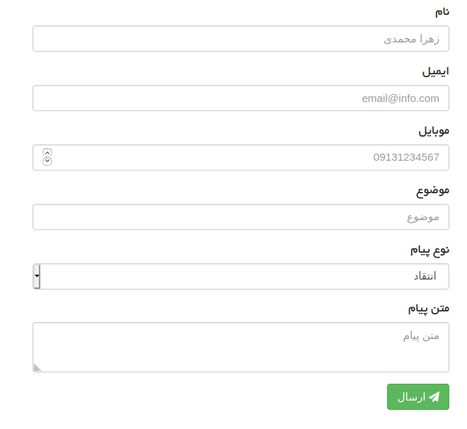
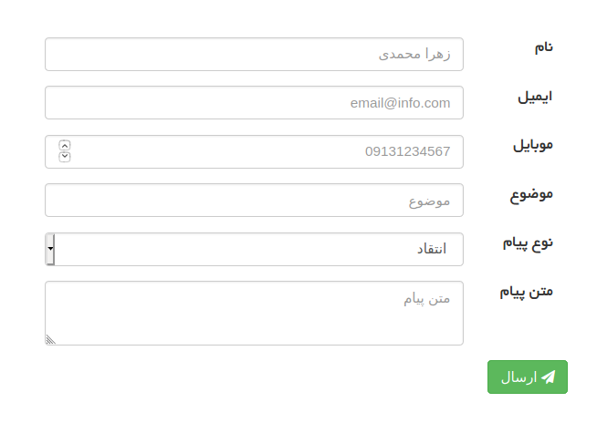

# فرم
فرم‌ها بخش مهمی از سایت را تشکیل می‌دهند. کاربر از طریق فرم ها اطلاعات مورد نیاز را برای شما ارسال میکند. از جمله مواردی که در زمان کار با فرم ها با آن ها روبرو هستیم میتوان به ارسال خطای اعتبار سنج های انجام شده در کنترلر به view و یا مقدار دهی اولیه به فیلد ها در زمان باز شدن فرم ها اشاره کرد.

در فریمورک کلاس `packages\base\views\form` برای مدیریت فرم‌‌ها و ارتباط بین کنترلر و view ایجاد شده است.
برای کار با فرم‌ها باید کلاس view از کلاس `packages\base\views\form` ارث بری کند و یا مخزن ( Trait ) `packages\base\views\traits\form` در کلاس view استفاده ( use ) شود.

**نمونه کلاس view :** ارث بری از کلاس
```php
<?php 
namespace themes\themename\views;

use packages\base\views\Form;

class ContactUs extends Form {
    
}
```

**نمونه کلاس view :** معرفی traits
```php
<?php 
namespace themes\themename\views;

use packages\base\View;
use packages\base\views\traits\Form;

class ContactUs extends View {
    use Form;
}
```

## مشخص کردن فیلدهای دارای خطا {#set-form-errors}
متد `setFormError()` فیلد‌های دارای خطا را برای ارسال به view مشخص میکند.
آرگومان ورودی این متد شئ از کلاس `packages\base\views\FormError` میباشد.

این متد در کنترلر برای ارسال فیلدهای دارای خطا به view صدا زده میشود .

**نمونه فایل کنترلر**
```php
<?php
namespace packages\packagename\controllers;

use packages\packagename\User as Model;
use themes\themename\views\packagename as views;
use packages\base\{Controller, Response, View, InputValidationException, Password};

class Main extends controller {
    
    public function login(): Response {

		$view = View::byName(views\Login::class);
	    $this->response->setView($view);
		
	    $inputRules = array(
	        "username" => array(
	            "type" => "email",
	        ),
	        "password" => array()
	    );
	    try {
	        $this->response->setStatus(false);
	        $inputs = $this->checkinputs($inputRules);
	        $model = new Model();
	        $model->where("email", $inputs["username"]);
			$user = $model->getOne()
	        if (!$user) {
	            throw new inputValidationException("username");
			}
			if (Password::verify($inputs["password"], $this->password)) {
	            throw new inputValidationException("password");
			}
			Session::set("login", true);
			Session::set("userID", $user->id);
	        $this->response->setStatus(true);
	        $this->response->Go(base\url("userpanel"));
	    } catch(InputValidationException $error) {
	        $view->setFormError(FormError::fromException($error));
	    }
	    return $this->response;
	}
}
```
در مثال فوق اگر داده های دریافتی نامعتبر باشند استثنا InputValidationException پرتاب میشود. در catch متد setFormError فراخوانی شده و فیلد دارای خطا را به عنوان ورودی دریافت میکند.

عملیات تبدیل استثنا های `packages\base\InputValidationException`و `packages\base\db\DuplicateRecord` به خطاهای فرم توسط فرم ورک به صورت خودکار انجام شده و لازم به نوشتن آن توسط برنامه نویس نیست.

__برای اطلاعات بیشتر از اعتبارسنجی به صفحه [اعتبارسنجی](validation.md) مراجعه کنید.__


## دریافت فیلدهای دارای خطا {#get-form-errors}
متدهای `getFormErrors()` و `getFormErrorsByInput($input)` 
برای دریافت خطاهای ثبت شده تعریف شده‌اند.

متد `getFormErrors` آرگومان ورودی دریافت نمیکند.
خروجی این متد آرایه‌‌ای از شئ کلاس `packages\base\views\FormError` میباشد که فیلدهای دارای خطا را مشخص میکند.

متد `getFormErrorsByInput` نام فیلد مورد نظر را در ورودی دریافت میکند و خروجی این متد اگر فیلد دارای خطا باشد شئ از کلاس packages\base\views\FormError و اگر خطا نداشته باشد false است.

**مثال**
```php
<form action="" method="post">
<?php
$fnameError = $this->getFormErrorsByInput('fname');
$lnameError = $this->getFormErrorsByInput('lname');
$socialNumberError = $this->getFormErrorsByInput('social_number');
?>
	<div class="form-group <?php echo $fnameError ? 'has-error' : ''; ?>">
		<label class="control-label" for="fname"><?php echo t("fname"); ?></label>
		<input type="text" name="fname" id="fname" class="form-control">
	<?php 
	if($fnameError) {
		$text = $fnameError->getMessage();
		if (!$text) {
			$text = t($fnameError->getCode());
		}
		echo "<span class=\"help-block\" >{$text}</span>";
	}
	?>
	</div>

	<div class="form-group <?php echo $lnameError ? 'has-error' : ''; ?>">
		<label class="control-label" for="lname"><?php echo t("lname"); ?></label>
		<input type="text" name="lname" class="form-control">
	<?php 
	if($lnameError) {
		$text = $lnameError->getMessage();
		if (!$text) {
			$text = t($lnameError->getCode());
		}
		echo "<span class=\"help-block\" >{$text}</span>";
	}
	?>
	<div class="form-group <?php echo $socialNumberError ? 'has-error' : ''; ?>">
		<label class="control-label" for="social_number"><?php echo t("social_number"); ?></label>
		<input type="text" name="social_number" class="form-control">
	<?php 
	if($socialNumberError) {
		$text = $socialNumberError->getMessage();
		if (!$text) {
			$text = t($socialNumberError->getCode());
		}
		echo "<span class=\"help-block\" >{$text}</span>";
	}
	?>
	</div>

</form>
```
در مثال فوق اگر هر کدام از فیلد ها دارای خطا باشند کلاس has-error به آن فیلد داده می‌شود. (که بطور مثال کادر فیلد قرمز شده و کاربر متوجه خطا در فیلد شود.)

همچنین میتوانید علت خطای به وجود آماده را نمایش دهید. با فراخوانی متد `getMessage` میتوانید در صورتیکه متن خطا در آن ذخیره شده باشد، آن را دریافت و نمایش دهید. همچنین میتوانید برای هر کد خطا یک ترجمه افزوده و آن را از طریق مترجم نمایش دهید.

**نکته**:‌ میتوانید کد خطا را دریافت کرده و با توجه به آن متن دلخواه خودرا نمایش دهید و استفاده از مترجم ( حتی در زمانیکه سایت شما تک زبانه است ) فقط برای کوتاه کردن کد ها و یکدست کردن خطا ها پیشنهاد شده است.

```php
<?php
namespace packages\packagename\controllers;

use function packages\base\url;
use packages\packagename\Trip\Signup as Model;
use themes\themename\views\packagename\Trips as views;
use packages\base\{Controller, Response, View, InputValidationException, db\DuplicateRecord};

class Trips extends Controller {
	public function signup(): Response {

		$view = View::byName(views\Signup::class);
	    $this->response->setView($view);

		$inputs = $this->checkInputs(array(
			"fname" => array(
				"type" => "string",
			),
			"lname" => array(
				"type" => "string",
			),
			"social_number" => array(
				"type" => "string",
			),
		));

		if (strlen($inputs["social_number"]) < 10) {
			throw new InputValidationException("social_number");
		}

		$model = new Model();
		$model->where("social_number", $inputs["social_number"]);
		if ($model->has()) {
			throw new DuplicateRecord("social_number");
		}

		$model = new Model();
		$model->name = $inputs["fname"];
		$model->last_name = $inputs["lname"];
		$model->social_number = $inputs["social_number"];
		$model->save();

		$this->response->Go(url("trips/signup/{$model->id}/overview"));

		$this->response->setStatus(true);
		return $this->response;
	}
}
```
### کد های استثناها

| کد                                                     |                                                                        استثنا |
|--------------------------------------------------------|------------------------------------------------------------------------------:|
| <span class="display-block ltr">data_validation</span> | <span class="display-block ltr">packages\base\InputValidationException</span> |
| <span class="display-block ltr">data_duplicate</span> | <span class="display-block ltr">packages\base\db\DuplicateRecord</span>       |

### نمونه فایل مترجم
```json
{
	"rtl": true,
	"phrases": [
		"data_validation": "داده وارد شده معتبر نیست",
		"data_duplicate": "داده وارد شده تکراری میباشد"
	]
}
```

**برای اطلاعات بیشتر به صفحه [مترجم](translator.md) و [خطاها در قالب](view_error.md) مراجعه کنید.**

## پاک کردن خطا یک فیلد {#clear-form-error}
اگر بخواهیم خطای ثبت شده برای یک فیلد را پاک کنیم از متد `clearInputErrors` استفاده میشود.
آرگومان ورودی این متد نام فیلد مورد نظر است.

**مثال**
```php
<?php
namespace themes\themename\views\packagename;

use packages\base\views\Form;

class Login extends Form {

	private $hasError = false;

	public function __beforeLoad() {
		$this->setTitle(t("login.title"));
		if ($this->getFormErrorsByInput("username") or $this->getFormErrorsByInput("password")) {
			$this->hasError = true;
			/**
			 * Prevent to show which field is wrong.
			 */
			$this->clearInputErrors("username");
			$this->clearInputErrors("password"); 
		}
	}
	/**
	 * You can use this to find form has error or not 
	 */
	protected function hasError(): bool {
		return $this->hasError;
	}
}

```


## مشخص کرد مقادیر فیلدهای فرم {#set-form-data}
برای مقداردهی فیلدهای فرم دو متد `setDataForm` و `setDataInput` تعریف شده است. متدها دو آرگومان ورودی میگیرند آرگومان اول مقدار فیلد و در آرگومان دوم نام فیلد به متد داده می‌شود.
برای مقداردهی فیلدها به روش فوق باید به ازای هر فیلد متد فراخوانی شود. برای جلوگیری از کدهای تکراری میتوانید آرگومان ورودی متد `setDataForm` را بصورت آرایه مقداردهی کنید در اینصورت فریمورک بصورت خودکار کلید هر خانه را نام فیلد و مقدار آن را مقدار فیلد در نظر میگیرد. 

**نکته :** اگر آرگومان اول آرایه باشد و آرگومان دوم نیز مقدار دهی شود (یعنی نام فیلد مشخص شود) تمامی آن آرایه برای آن کلید در نظر گرفته میشود. (برای input های چنتایی و آرایه‌ای کاربرد دارد) 

**توجه :** از متد `setDataInput` فقط برای مقداردهی یک فیلد استفاده می‌شود.

یکی از کاربردهای تعریف آرایه‌ای فیلدها زمانی است که تعداد فیلدها متغیر باشد برای سهولت در اعتبارسنجی و مدیریت فیلدها از نام گذاری فیلدها بصورت آرایه‌ای استفاده میکنیم.

**نمونه مقداردهی آرایه ای متد setDataForm**
```php
$this->setDataForm(array(
    'telegram' => '@jalno_support',
    'twitter' => '@jalnoco',
), 'socialnets');

// or

$this->setDataForm(array(
    'socialnets' => array(
        'telegram' => '@jalno_support',
        'twitter' => '@jalnoco',
    ),
));
```

در input ها بصورت زیر میتوان به مقادیر دسترسی داشت.
```php
<input type="text" value="<?php echo $this->getDataForm('socialnets')['twitter'] ?? ''; ?>" name="socialnets[twitter]" class="form-control ltr" placeholder="Twitter">
<input type="text" value="<?php echo $this->getDataForm('socialnets')['telegram'] ?? ''; ?>" name="socialnets[telegram]" class="form-control ltr" placeholder="Telegram">
```

**مثال 1 :** نمونه فایل کنترلر
```php
<?php
namespace packages\packagename\controllers;

use packages\base\{Controller, Response}
use pacakges\packagename\ContactLetter as Model;
use themes\themename\views\pacakgename\contact as views;

class ContactUS extends Controller {
	public function store(): Response {

		$view = View::byName(Views\Add::class);
		$this->response->setView($view);

		$inputRules = array(
			"name" => array(
				"type" => "string",
			),
			"message" => array(
				"type" => "string",
			),
		);
		try {
			$inputs = $this->checkinputs($inputRules);

			$model = new Model();
			$model->name = $inputs['name'];
			$model->message = $inputs['message'];
			$model->save();

			$this->response->setStatus(true);
		} catch(inputValidationException $error) {
			$view->setFormError(FormError::fromException($error));
			$view->setDataForm($this->inputsvalue($inputRules));
		}
		return $this->response;
	}
}
```

متد `inputsvalue` تمامی مقادیر ارسال شده توسط کاربر در فیلد های مشخص شده در متغیر `$inputRules` را در قالب یک آرایه کلید-مقدار برمیگرداند. کلید هر خانه نام فیلد و مقدار آن همان مقدار ارسال شده توسط کاربر است.
این متد به شما این قابلیت را میدهد تا بعد از بروز هر خطا در صفحه مجددا مقادیر ارسال شده توسط کاربر را در هر فیلد قرار داده تا کاربر مجبور نباشد تمامی فیلد ها را مقدار دهی کند.

**نکته**: در استثناهای مدیریت شده توسط فرم ورک، این اقدام به صورت خودکار انجام میشود.

**مثال 2 :** نمونه فایل view
```php
<?php 
namespace themes\themename\views;

use packages\base\{views\Form, Date};

class Add extends Form {
	public function __beforeLoad(){
		if (!$this->getDataForm("started_at")) {
			$this->setDataForm(Date::format('Y/m/d'), "started_at");
		}
	}
}
```
در مثال فوق ابتدا با متد getDataForm بررسی میشود اگر فیلد با نام date مقدار نداشته باشد زمان فعلی برای مقدار آن، مقداردهی میشود.


## مقداردهی فیلدها  {#howto-set-value-for-form-fields}
برای مقداردهی فیلدها متد‌های `getDataForm()` و `getDataInput()` تعریف شده است.

هر دو متد به عنوان ارگومان ورودی نام فیلد را دریافت میکنند.
اگر برای فیلد مشخص شده هیچ مقداری مشخص نشده باشد خروجی متد getDataForm خالی ( null ) و خروجی متد getDataInput یک رشته خالی است.

اگر بخواهیم بعد از بارگذاری صفحه فیلد ها با مقادیر مورد نظر مقدار دهی شده باشند باید متدهای فوق را در value تگ‌های فرم فراخوانی کنیم.


**مثال 1 :** نمونه فایل view
```php
<?php 
namespace themes\themename\views;
use packages\base\views\Form;
use packages\base\date; 

class Add extends Form {
	function __beforeLoad(){
		if (!$this->getDataInput("fname")) {
			$this->setDataForm("first name", "fname");
		}
		if (!$this->getDataInput("lname")) {
			$this->setDataForm("last name", "lname");
		}
	}
}
```

**مثال 2** نمونه فایل html
```php
<form action="" method="post">
	<input type="text" name="fname" value="<?php echo $this->getDataForm('fname');?>">	
	<input type="text" name="lname" value="<?php echo $this->getDataForm('lname');?>">
</form>
```

**توجه :** ابتدا باید فیلد توسط متد setDataForm یا setDataInput مقدار دهی شده باشد تا بتوان با متد های getDataForm یا getDataInput مقدار آنها را دریافت کرد.


## متد createField {#userpanel_createfield}
برای سهولت در مدیریت خطا‌ها و مقداردهی فرم‌ها میتوانید از متد `createField` که در پکیج [یوزرپنل](https://github.com/Jalno/userpanel) تعریف شده است استفاده کنید. 
این متد استثناهای `packages\base\InputValidationException` و `packages\base\db\DuplicateRecord` پرتاب شده را در قالب فرم نمایش می‌دهد. همچنین اگر فیلدی مقدار دهی شده باشد، مقدار دهی میکند و اگر فیلدی خطا داشته باشد، متن خطا را زیر آن نمایش میدهد.

برای استفاده از متد createField لازم است مخزن (Trait) `themes\clipone\views\formTrait` در کلاس view استفاده (use) شود.

**نکته**:درحال حاضر پکیج یوزرپنل از boostrap نسخه‌ی 3 استفاده میکند و ظاهر ایجاد شده برای فرم ها بر اساس boostrap نسخه‌ی 3 است.


```php
<?php 
namespace themes\themename\views;

use packages\base\View;
use themes\clipone\views\formTrait;

class ContactUs extends View {
    use formTrait;
}
```

آرگومان ورودی متد createField آرایه‌ کلید-مقدار از مشخصات فرم میباشد. 
مشخصه های زیر را میتوانید برای فیلدها تعریف کنید.

+ **[type](#createfield_type)**: نوع فیلد را مشخص میکند. (تمامی نوع های فیلد ها را دریافت میکند.)
+ **name**: نام فیلد را دریافت میکند. 
+ **placeholder**: متن پیشفرض در زمان خالی بودن فیلد را دریافت میکند.
+ **value**: مقدار پیشفرض فیلد را دریافت میکند.
+ **label**: عنوان فیلد را دریافت میکند.
+ **class**: کلاس های css برای فیلد را دریافت میکند.
+ **id**: شناسه ی فیلد را دریافت میکند
+ **required**: اجباری بودن و یا نبودن فیلد را دریافت میکند.
+ **minlength**: حداقل طول رشته را دریافت میکند.
+ **maxlength**: حداکثر طول رشته را دریافت میکند.
+ **icon**: اگر این فیلد مقدار دهی شود، فیلد ها به صورت [input-group](https**://getbootstrap.com/docs/3.4/components/#input-groups) ایجاد میشوند.
+ **title**: مقدار title برای فیلد را دریافت میکند.
+ **disabled**: فعال بودن و یا نبودن فیلد را دریافت میکند.
+ **readonly**: قابل نوشتن و یا فقط خواندن فیلد را دریافت میکند.
+ **rows**: مقدار سطر های فیلد های textarea را دریافت میکند..
+ **min, max, step**: مقدار های حداقل، حداکثر و پله های افزایش عدد در فیلد های number را دریافت میکند.
+ **accept**: نوع فایل های قابل پذیرش برای فیلد ها file را دریافت میکند..
+ **[ltr](#createfield_ltr)**: برای فیلدهایی که باید مقدار آن‌ها از چپ به راست نوشته شود کاربرد دارد.
+ **[data](#createfield_data)**: برای data هایی که توسط جاوااسکریپت قابل خواندن هستند. استفاده میشود.


### type {#createfield_type}
type تمامی نوع هایی که برای فرم ها وجود دارد را میپذیرد. اگر مقدار آن select یا radio یا checkbox باشد، باید کلید options .نیز برای آن تعریف کرد کلید options و به عنوان پارامتر آرایه‌ کلید-مقدار دریافت می‌کند که کلیدهای آن title و مقدار آن value را ایجاد میکند.

مقدار پیشفرض کلید type برابر text میباشد.

**مثال**
```php
<form action="" method="post">
	<?php
		$fields = [
			[
				'name' => 'name',
				'type' => 'text',
				'placeholder' => 'زهرا محمدی',
				'label' => 'نام'
			],
			[
				'label' => 'ایمیل',
				'placeholder' => 'email@info.com',
				'name' => 'email',
				'type' => 'email',
			],
			[
				'label' => 'موبایل',
				'placeholder' => '09131234567',
				'name' => 'mobile',
				'type' => 'number',
				'minlength' => 10,
				'maxlength' => 12
			],
			[
				'label' => 'موضوع',
				'placeholder' => 'موضوع',
				'name' => 'subject',
				'type' => 'text'
			],
			[
				'label' => 'نوع پیام',
				'name' => ' msgType',
				'type' => 'select',
				'options' => [
					[
						'value' => 1,
						'title' => 'انتقاد'
					],
					[
						'value' => 2,
						'title' => 'پیشنهاد'
					]
				]
			],
			[
				'label' => 'متن پیام',
				'placeholder' => 'متن پیام',
				'label' => 'متن پیام',
				'name' => 'msg',
				'type' => 'textarea'
				'required' => true
			]
		];
		foreach($fields as $row){
			$this->createField($row);
		}
		?>
	
	<button type="submit" class="btn btn-success"><i class="fa fa-send"></i> ارسال </button>
</form>
```

نتیجه کد فوق بصورت کدهای html زیر میباشد
```html
<form action="" method="post">
    <div class="form-group">
		<label class="control-label">نام</label>
		<input type="text" value="" name="name" class="form-control" placeholder="زهرامحمدی">
	</div>
    <div class="form-group">
		<label class="control-label">ایمیل</label>
		<input type="email" value="" name="email" class="form-control" placeholder="email@info.com">
	</div>
    <div class="form-group">
		<label class="control-label">موبایل</label>
		<input type="number" value="" minlength="10" maxlength="12" name="mobile" class="form-control" placeholder="09131234567">
	</div>
    <div class="form-group">
		<label class="control-label">موضوع</label>
		<input type="text" value="" name="subject" class="form-control" placeholder="موضوع">
	</div>
    <div class="form-group">
		<label class="control-label">نوع پیام</label>
		<select name=" msgType" class="form-control">
            <option value="1">انتقاد</option>
            <option value="2">پیشنهاد</option>
		</select>
	</div>
    <div class="form-group">
		<label class="control-label">متن پیام</label>
		<textarea required="" name="msg" class="form-control" placeholder="متن پیام"></textarea>
    </div>
    <button type="submit" class="btn btn-success">
		<i class="fa fa-send"></i> ارسال 
	</button>
</form>
```

فرم ایجاد شده درصفحه وب بصورت زیر نمایش داده میشود.

اگر بخواهید فیلدهای فرم در یک خط ایجاد شوند میتوانید از متد `setHorizontalForm` استفاده کنید. 
این متد با استفاده از کلاس های grid بندی بوت‌استرپ فیلدهای فرم را تک خطی نمایش می‌دهد. 

متد setHorizontalForm دو آرگومان ورودی میگیرد. آرگومان اول کلاس گرید مربوط به label و آرگومان دوم کلاس گرید مربوط به input میباشد.

به صورت زیر میتوانید متد را مقدار دهی کنید
```php
<?php
	$this->setHorizontalForm("sm-2", "sm-10");
	foreach($fields as $row){
		$this->createField($row);
	}
?>
```

خروجی کد فوق بصورت زیر می‌باشد.
```html
<form action="" method="post" style="overflow: auto">
    <div class="form-group">
        <label class="control-label col-sm-2">نام</label>
        <div class="col-sm-10">
            <input type="text" value="" name="name" class="form-control" placeholder="زهرا محمدی" />
        </div>
    </div>
    <div class="form-group">
        <label class="control-label col-sm-2">ایمیل</label>
        <div class="col-sm-10">
            <input type="email" value="" name="email" class="form-control" placeholder="email@info.com" />
        </div>
    </div>
    <div class="form-group">
        <label class="control-label col-sm-2">موبایل</label>
        <div class="col-sm-10">
            <input type="number" value="" minlength="10" maxlength="12" name="mobile" class="form-control"
                placeholder="09131234567" />
        </div>
    </div>
    <div class="form-group">
        <label class="control-label col-sm-2">موضوع</label>
        <div class="col-sm-10">
            <input type="text" value="" name="subject" class="form-control" placeholder="موضوع" />
        </div>
    </div>
    <div class="form-group">
        <label class="control-label col-sm-2">نوع پیام</label>
        <div class="col-sm-10">
            <select name=" msgType" class="form-control">
                <option value="1">انتقاد</option>
                <option value="2">پیشنهاد</option>
            </select>
        </div>
    </div>
    <div class="form-group">
        <label class="control-label required col-sm-2">متن پیام</label>
        <div class="col-sm-10">
            <textarea required="" name="msg" class="form-control" placeholder="متن پیام"></textarea>
        </div>
    </div>
    <button type="submit" class="btn btn-success">
        <i class="fa fa-send"></i> ارسال
    </button>
</form>
```

فرم ایجاد شده درصفحه وب بصورت زیر نمایش داده میشود.




### ltr {#createfield_ltr}
 اگر مقدار true به کلید ltr داده شود کلاس ltr به فیلد اضافه می‌شود. در پکیج یوزرپنل کلاس ltr بصورت زیر تعریف شده است.

```css
.ltr {
    direction: ltr;
    text-align: left;
}
```

### data {#createfield_data}
کلید `data` یک آرایه کلید-مقدار میگیرد که از آن برای تولید data هایی که توسط جاوااسکریپت قابل خواندن هستند استفاده می‌شود.

```php
$this->createField(array(
    'name' => 'operator_name',
    'label' => 'اپراتور',
    'type' => 'text', // This is optional
    'title' => 'برای جستجو اپراتور قسمتی از نام و یا ایمیل آن را وارد کرده و از بین نتایج یکی را انتخاب کنید',
    'data' => array(
         'toggle' => 'tooltip',
         'placement' => 'top',
    ),
));
```

خروجی متد فوق بصورت زیر است
```php
<div class="form-group">
    <label class="control-label">اپراتور</label>
    <input type="text" value="" name="operator_name" class="form-control" title="برای جستجو اپراتور قسمتی از نام و یا ایمیل آن را وارد کرده و از بین نتایج یکی را انتخاب کنید" data-toggle="tooltip" data-placement="top">
</div>
```
