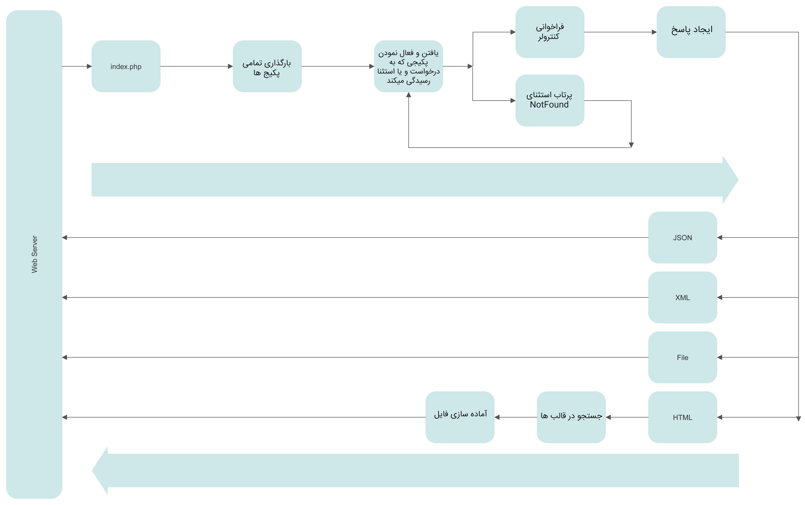

# Request Lifecycle

The starting point for all requests is the `index.php` file in the root directory. All requests, after entering the web server (Nginx, Apache, or others), will be transferred to the `index.php` file. Although this file is not very large, it is the starting point that initializes the rest of the framework.

The `index.php` file first identifies and loads all packages, and then, based on the rules declared by each package, finds and activates the package that will handle this request. It calls the specified controller and waits until the controller's instructions are completed to receive the request response and return it to the web server for display to the user.

The request response can be in JSON, XML, a file for download, an HTML page, or it can simply redirect the user to another address on the internet. If the response is HTML, the framework searches for the template specified by the controller among the templates, calls it for preparation, and finally displays the prepared page to the user.

If the request is not handled by any package, the framework will automatically throw an exception of type `packages\base\NotFound`. If a package has declared this exception in its routing rules, the framework will activate that package and call the specified controller. Otherwise, depending on whether or not error display is enabled, an error message or an empty response will be displayed to the user.

## Process Flow

1. **Request Enters Web Server:** The web server receives a request from the user's browser.

2. **Request Routed to index.php:** The web server routes the request to the `index.php` file in the root directory.

3. **Package Initialization:** The `index.php` file loads and initializes all Jalno packages.

4. **Route Matching:** The framework matches the request against the routing rules defined by each package.

5. **Package Activation:** The package that matches the request is activated, and its controller is identified.

6. **Controller Execution:** The framework calls the specified controller method to handle the request.

7. **Response Generation:** The controller generates a response, which can be JSON, XML, HTML, a file download, or a redirect.

8. **Response Handling:** The framework prepares the response and sends it back to the web server.

9. **Web Server Response:** The web server delivers the response to the user's browser.

10. **User Interaction:** The user receives the response and interacts with the application.

## Exception Handling

1. **Unhandled Request:** If no package matches the request, the framework throws a `packages\base\NotFound` exception.

2. **Exception Routing:** The framework checks if any package has declared a handler for the `NotFound` exception.

3. **Handler Activation:** If a handler is found, the corresponding package is activated, and its controller is identified.

4. **Handler Execution:** The framework calls the specified controller method to handle the exception.

5. **Error Response:** The controller generates an error response, which may include a message or an empty response.

6. **Response Handling:** The framework prepares the error response and sends it back to the web server.

7. **Web Server Response:** The web server delivers the error response to the user's browser.

8. **User Interaction:** The user receives the error response and may take corrective actions.

