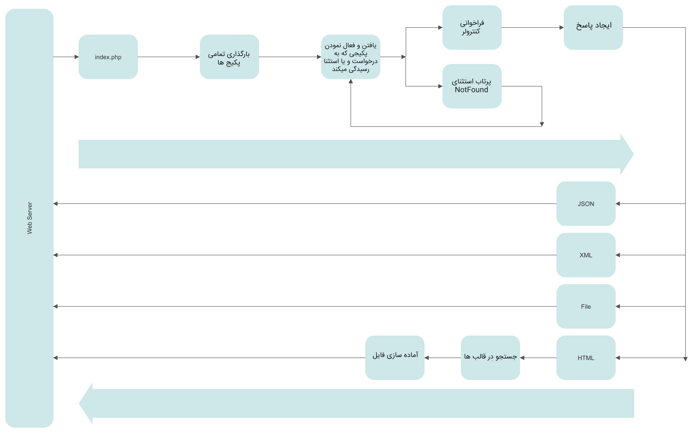

# چرخه زندگی

نقطه ی شروع برای تمامی درخواست ها فایل index.php در پوشه ی اصلی است. تمامی درخواست ها پس از ورود به وب سرور (Nginx ، Apache و یا ...) به فایل index.php منتقل خواهند شد. هر چند که این فایل دارای حجم زیادی نیست اما نقطه شروعی است که مابقی فریم ورک را راه اندازی میکند.

فایل index.php ابتدا تمامی پکیج ها را شناسایی و بارگذاری میکند و پس از این با توجه به قوانینی که هر یک از پکیج ها اعلام کرده اند، پکیجی که به این درخواست رسیدگی میکند را پیدا و فعال میکند. کنترل معرفی شده را فراخوانی و منتظر میماند تا بعد از انجام دستورات در کنترلر پاسخ درخواست را دریافت و به وب سرور برای نمایش به کاربر بازگرداند. 

پاسخ درخواست میتواند از نوع JSON، XML، یک فایل برای دانلود، یک صفحه ی HTML باشد و یا به کلی کاربر را به آدرس دیگری در اینترنت منتقل کند. اگر پاسخ از نوع HTML باشد، فرم ورک صفحه ی معرفی شده توسط کنترلر را در بین قالب‌ها جستجو و آن را برای آماده سازی فراخوانی و در انتها صفحه ی آماده شده را به کاربر نمایش میدهد.

اگر درخواست توسط هیچ پکیجی رسیدگی نشود، فرم ورک به صورت خودکار یک استثناء از نوع packages\base\NotFound پرتاب میکند. اگر یک پکیج در قوانین مسیریابی مشخص شده این استثناء را معرفی کرده باشد، فرم ورک آن پکیج را فعال و کنترل مشخص شده را فراخوانی میکند. در غیر این صورت وابسته به اینکه نمایش خطا ها روشن باشد یا نه، متن خطا و یا یک پاسخ خالی به کاربر نمایش داده خواهد شد.

